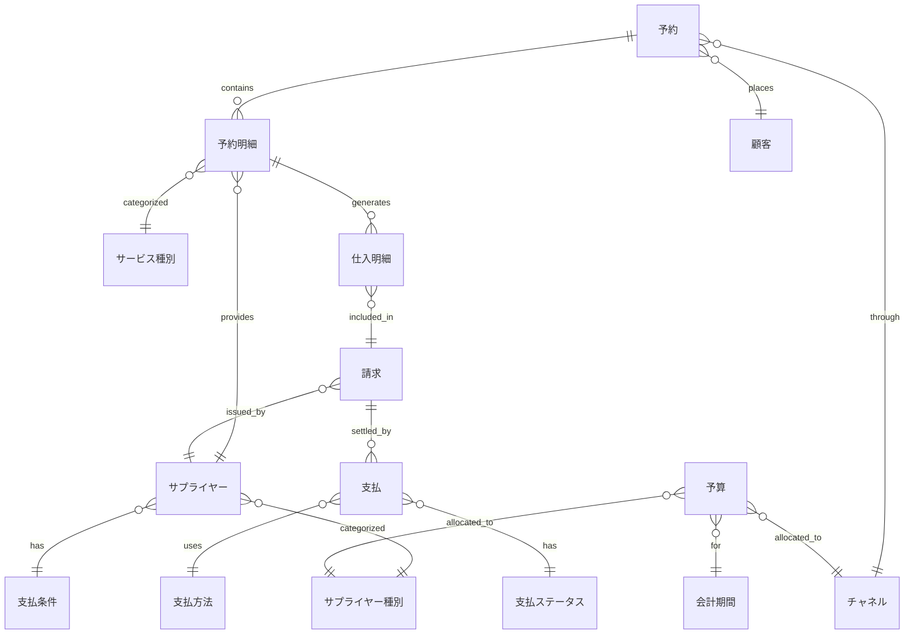

# キャッシュアウトコントロール データ分析基盤 - 論理データモデル設計書

## 1. 概要

### 1.1 目的
旅行業における国内事業のサプライヤー支払管理を対象とした、キャッシュアウトコントロールのためのデータ分析基盤の論理データモデルを定義する。

### 1.2 主要目標
- 支払タイミングの最適化によるキャッシュフロー改善
- 支払予測精度の向上
- チャネル別・サプライヤー種別の多角的分析

### 1.3 対象範囲
- **ビジネスチャネル**: 顧客予約型、事前仕入型、月次一括精算型
- **サプライヤー種別**: 宿泊施設、交通機関（航空・鉄道・バス）、観光施設、飲食店
- **データソース**: 予約管理システム、会計システム、支払管理システム

---

## 2. 主要KPI定義

### 2.1 キャッシュフロー管理KPI

#### KPI-001: 日次支払予測額
**定義**: 今後30日間の各日における予測支払額

**計算式**:
```
日次支払予測額(日付D) = 
  Σ(確定支払額 + 予測支払額)
  WHERE 支払予定日 = D
```

**分析軸**: 日付別、サプライヤー種別、チャネル別、支払条件別  
**更新頻度**: 日次

---

#### KPI-002: 週次キャッシュアウト実績
**定義**: 週単位の実際の支払総額

**計算式**:
```
週次キャッシュアウト実績(週W) = 
  Σ(支払金額)
  WHERE 支払実行日 BETWEEN W開始日 AND W終了日
  AND 支払ステータス = '完了'
```

**分析軸**: 週別、サプライヤー種別、チャネル別、支払方法別  
**更新頻度**: 日次

---

#### KPI-003: 月次キャッシュアウト予算達成率
**定義**: 月次予算に対する実績支払額の比率

**計算式**:
```
月次予算達成率(月M) = 
  (実績支払額 / 予算支払額) × 100
  WHERE 会計月 = M
```

**分析軸**: 月別、サプライヤー種別、チャネル別、部門別  
**更新頻度**: 日次

---

### 2.2 支払予測精度KPI

#### KPI-004: 支払予測精度（MAPE）
**定義**: 予測支払額と実績支払額の平均絶対誤差率

**計算式**:
```
MAPE = 
  (1/n) × Σ|実績支払額 - 予測支払額| / 実績支払額 × 100
  WHERE 支払実行日 BETWEEN 分析期間開始 AND 分析期間終了
```

**分析軸**: 予測期間別（1週間先、2週間先、1ヶ月先）、サプライヤー種別、チャネル別  
**更新頻度**: 週次

---

#### KPI-005: 支払遅延率
**定義**: 予定支払日を超過した支払の割合

**計算式**:
```
支払遅延率 = 
  (遅延支払件数 / 総支払件数) × 100
  WHERE 支払実行日 > 支払予定日
```

**分析軸**: 月別、サプライヤー種別、遅延日数区分別  
**更新頻度**: 日次

---

### 2.3 サプライヤー管理KPI

#### KPI-006: サプライヤー別支払集中度
**定義**: 上位サプライヤーへの支払集中度（パレート分析）

**計算式**:
```
支払集中度 = 
  上位N社の支払額合計 / 全サプライヤー支払額合計 × 100
```

**分析軸**: 上位10社、上位20社、上位50社、サプライヤー種別、期間別  
**更新頻度**: 月次

---

#### KPI-007: サプライヤー別平均支払サイト
**定義**: サプライヤーごとの請求受領から支払実行までの平均日数

**計算式**:
```
平均支払サイト = 
  Σ(支払実行日 - 請求受領日) / 支払件数
  GROUP BY サプライヤーID
```

**分析軸**: サプライヤー別、サプライヤー種別、支払条件別  
**更新頻度**: 月次

---

### 2.4 チャネル別分析KPI

#### KPI-008: チャネル別支払構成比
**定義**: 各ビジネスチャネルの支払額構成比

**計算式**:
```
チャネル別構成比 = 
  (チャネル別支払額 / 総支払額) × 100
```

**分析軸**: チャネル別（顧客予約型、事前仕入型、月次一括精算型）、月別、サプライヤー種別  
**更新頻度**: 月次

---

#### KPI-009: チャネル別平均支払リードタイム
**定義**: 予約/仕入から支払実行までの平均日数

**計算式**:
```
平均リードタイム = 
  Σ(支払実行日 - 予約/仕入日) / 件数
  GROUP BY チャネル
```

**分析軸**: チャネル別、サプライヤー種別、月別  
**更新頻度**: 月次

---

### 2.5 異常検知KPI

#### KPI-010: 支払額異常検知率
**定義**: 過去平均から統計的に逸脱した支払の割合

**計算式**:
```
異常検知率 = 
  (異常支払件数 / 総支払件数) × 100
  WHERE |支払額 - 平均支払額| > 2σ
```

**分析軸**: サプライヤー別、サプライヤー種別、月別  
**更新頻度**: 日次

---

## 3. 論理データモデル

### 3.1 エンティティ関連図（ER図）



### 3.2 主要エンティティ定義

#### 3.2.1 予約（Reservation）
顧客からの旅行予約情報を管理

#### 3.2.2 予約明細（Reservation Detail）
予約に含まれる個別サービス（宿泊、交通、観光等）の詳細

#### 3.2.3 仕入明細（Procurement Detail）
サプライヤーから仕入れたサービスの詳細と原価情報

#### 3.2.4 請求（Invoice）
サプライヤーからの請求情報

#### 3.2.5 支払（Payment）
実際の支払実行情報

#### 3.2.6 サプライヤー（Supplier）
取引先サプライヤーのマスタ情報

#### 3.2.7 予算（Budget）
キャッシュアウトの予算計画

---

## 4. 次のステップ

詳細なデータ項目一覧は別ファイルで提供します：
- [`cash-out-control-data-items.md`](cash-out-control-data-items.md) - 全エンティティの詳細データ項目定義
- [`cash-out-control-kpi-mapping.md`](cash-out-control-kpi-mapping.md) - KPI計算に必要なデータ項目マッピング