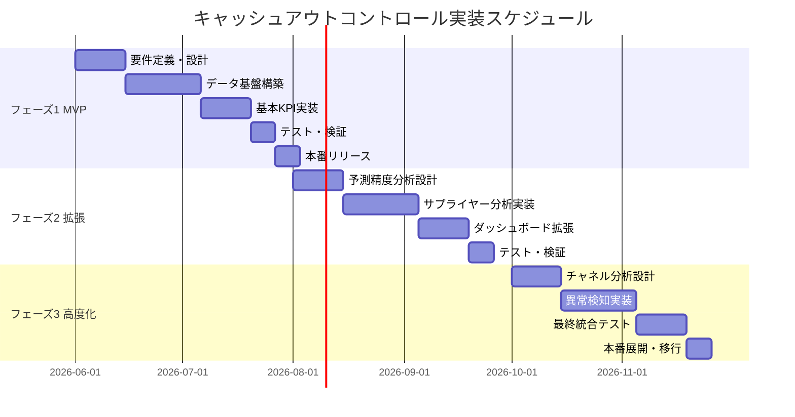

# キャッシュアウトコントロール データ分析基盤 - 実装計画書

## 1. プロジェクト概要

### 1.1 プロジェクト目標
旅行業における国内事業のサプライヤー支払管理を対象とした、キャッシュアウトコントロールのためのデータ分析基盤を構築し、支払タイミングの最適化とキャッシュフロー改善を実現する。

### 1.2 成果物
1. 論理データモデル設計書
2. データ項目一覧
3. KPI計算ロジック定義書
4. データ連携仕様書
5. ダッシュボード設計書
6. 運用手順書

### 1.3 プロジェクト期間
- 全体期間: 6ヶ月
- フェーズ1（MVP）: 2ヶ月
- フェーズ2: 2ヶ月
- フェーズ3: 2ヶ月

---

## 2. 実装アプローチ

### 2.1 段階的実装（3フェーズ）



---

## 3. フェーズ別実装計画

### フェーズ1: MVP（最小実用製品）

#### 3.1.1 目標
基本的なキャッシュフロー管理機能を提供し、日次・週次・月次の支払状況を可視化する。

#### 3.1.2 実装範囲

**データモデル**:
- 予約（Reservation）
- 予約明細（Reservation Detail）
- 仕入明細（Procurement Detail）
- 請求（Invoice）
- 支払（Payment）
- サプライヤー（Supplier）
- 予算（Budget）
- 必要なマスタテーブル全て

**KPI**:
- KPI-001: 日次支払予測額
- KPI-002: 週次キャッシュアウト実績
- KPI-003: 月次キャッシュアウト予算達成率

**ダッシュボード**:
1. **キャッシュフロー予測ダッシュボード**
   - 今後30日間の日次支払予測グラフ
   - サプライヤー種別別の支払予測
   - チャネル別の支払予測

2. **実績管理ダッシュボード**
   - 週次支払実績トレンド
   - 月次予算達成率
   - サプライヤー種別別の実績比較

#### 3.1.3 データ連携
- 予約管理システムからの日次バッチ連携
- 支払管理システムからの日次バッチ連携
- 会計システムからの月次バッチ連携

#### 3.1.4 成功基準
- 日次支払予測の自動更新が稼働
- 予測精度が±20%以内
- ダッシュボードの表示速度が3秒以内
- ユーザー満足度スコア 4.0/5.0以上

---

### フェーズ2: 予測精度向上とサプライヤー分析

#### 3.2.1 目標
支払予測の精度を向上させ、サプライヤー別の詳細分析機能を提供する。

#### 3.2.2 実装範囲

**KPI**:
- KPI-004: 支払予測精度（MAPE）
- KPI-006: サプライヤー別支払集中度
- KPI-007: サプライヤー別平均支払サイト

**機能追加**:
1. **予測精度モニタリング**
   - 予測と実績の差異分析
   - 予測精度のトレンド分析
   - 予測モデルの改善提案

2. **サプライヤー分析**
   - パレート分析（ABC分析）
   - 支払サイト分析
   - サプライヤー別支払トレンド

**ダッシュボード**:
3. **予測精度ダッシュボード**
   - MAPE推移グラフ
   - 予測期間別の精度比較
   - 改善アクション提案

4. **サプライヤー分析ダッシュボード**
   - 上位サプライヤーランキング
   - 支払集中度グラフ
   - 支払サイト比較

#### 3.2.3 データ連携強化
- リアルタイムAPI連携の検討
- データ品質チェック機能の追加

#### 3.2.4 成功基準
- 予測精度が±15%以内に改善
- サプライヤー分析レポートの自動生成
- 月次レビュー会議での活用実績

---

### フェーズ3: チャネル分析と異常検知

#### 3.3.1 目標
チャネル別の詳細分析と異常検知機能により、プロアクティブな支払管理を実現する。

#### 3.3.2 実装範囲

**KPI**:
- KPI-005: 支払遅延率
- KPI-008: チャネル別支払構成比
- KPI-009: チャネル別平均支払リードタイム
- KPI-010: 支払額異常検知率

**機能追加**:
1. **チャネル分析**
   - チャネル別収益性分析
   - リードタイム最適化提案
   - チャネル別キャッシュフロー予測

2. **異常検知・アラート**
   - 統計的異常検知（Z-score）
   - 支払遅延アラート
   - 予算超過アラート
   - 異常パターンの自動通知

**ダッシュボード**:
5. **チャネル分析ダッシュボード**
   - チャネル別支払構成比
   - リードタイム比較
   - チャネル別収益性

6. **異常検知ダッシュボード**
   - 異常検知アラート一覧
   - 異常パターン分析
   - 対応履歴管理

#### 3.3.3 高度化機能
- 機械学習による予測精度向上
- 自動レポート生成・配信
- モバイルアプリ対応

#### 3.3.4 成功基準
- 異常検知の適合率 80%以上
- アラート対応時間の50%削減
- 予測精度が±10%以内に改善
- 全社展開の承認取得

---

## 4. 技術スタック推奨

### 4.1 データ基盤
- **データウェアハウス**: Amazon Redshift / Google BigQuery / Snowflake
- **ETLツール**: Apache Airflow / AWS Glue / dbt
- **データレイク**: Amazon S3 / Google Cloud Storage

### 4.2 分析・可視化
- **BIツール**: Tableau / Power BI / Looker
- **分析言語**: Python (pandas, scikit-learn) / SQL
- **ノートブック**: Jupyter Notebook / Google Colab

### 4.3 データ連携
- **API**: REST API / GraphQL
- **メッセージング**: Apache Kafka / AWS Kinesis
- **バッチ処理**: Apache Airflow / AWS Batch

### 4.4 監視・運用
- **監視**: Datadog / CloudWatch / Grafana
- **ログ管理**: ELK Stack / Splunk
- **アラート**: PagerDuty / Slack連携

---

## 5. データ連携仕様

### 5.1 予約管理システム連携

**連携方式**: バッチ連携（日次 AM 2:00実行）

**連携データ**:
```
予約データ (reservations.csv)
├─ reservation_id
├─ reservation_number
├─ customer_id
├─ channel_id
├─ reservation_datetime
├─ travel_start_date
├─ travel_end_date
├─ reservation_status
├─ total_sales_amount
└─ total_cost_amount

予約明細データ (reservation_details.csv)
├─ reservation_detail_id
├─ reservation_id
├─ detail_number
├─ supplier_id
├─ service_type_id
├─ service_name
├─ service_date
├─ quantity
├─ unit_price
├─ sales_amount
├─ unit_cost
└─ cost_amount
```

**データ品質チェック**:
- 必須項目の存在チェック
- 外部キーの整合性チェック
- 金額の妥当性チェック（負数不可）
- 日付の妥当性チェック

---

### 5.2 支払管理システム連携

**連携方式**: バッチ連携（日次 AM 3:00実行）

**連携データ**:
```
仕入明細データ (procurement_details.csv)
├─ procurement_detail_id
├─ reservation_detail_id
├─ supplier_id
├─ procurement_date
├─ procurement_amount
├─ tax_amount
├─ scheduled_payment_date
├─ invoice_id
└─ procurement_status

請求データ (invoices.csv)
├─ invoice_id
├─ invoice_number
├─ supplier_id
├─ invoice_date
├─ invoice_received_date
├─ invoice_amount
├─ tax_amount
├─ payment_due_date
├─ scheduled_payment_date
├─ invoice_status
└─ remarks

支払データ (payments.csv)
├─ payment_id
├─ invoice_id
├─ supplier_id
├─ scheduled_payment_date
├─ payment_execution_date
├─ payment_amount
├─ payment_method_id
├─ payment_status_id
├─ transfer_fee
├─ approver_id
├─ approved_at
└─ remarks
```

---

### 5.3 会計システム連携

**連携方式**: バッチ連携（月次 月初AM 1:00実行）

**連携データ**:
```
予算データ (budgets.csv)
├─ budget_id
├─ fiscal_year
├─ fiscal_month
├─ supplier_type_id
├─ channel_id
├─ budget_amount
└─ remarks

会計期間データ (fiscal_periods.csv)
├─ fiscal_period_id
├─ fiscal_year
├─ fiscal_month
├─ period_start_date
├─ period_end_date
└─ business_days
```

---

## 6. ダッシュボード設計

### 6.1 キャッシュフロー予測ダッシュボード

**対象ユーザー**: 経理部門、財務部門、経営層

**主要コンポーネント**:
1. **30日間支払予測カレンダー**
   - 日別の予測支払額を色分け表示
   - 高額支払日をハイライト
   - クリックで詳細表示

2. **支払予測トレンドグラフ**
   - 折れ線グラフ（日次）
   - サプライヤー種別別の積み上げ表示
   - 予算ラインの表示

3. **サプライヤー種別別予測**
   - 円グラフまたは棒グラフ
   - 上位5種別の詳細表示

4. **チャネル別予測**
   - 棒グラフ
   - 前月比較

5. **アラート表示**
   - 予算超過予測
   - 大口支払予定
   - 支払集中日

---

### 6.2 実績管理ダッシュボード

**対象ユーザー**: 経理部門、財務部門

**主要コンポーネント**:
1. **週次支払実績トレンド**
   - 折れ線グラフ（週次）
   - 前年同期比較
   - 移動平均線

2. **月次予算達成率**
   - ゲージチャート
   - 当月・前月・前年同月の比較
   - 達成率の色分け（緑/黄/赤）

3. **サプライヤー種別別実績**
   - 棒グラフ
   - 予算との差異表示

4. **支払方法別内訳**
   - 円グラフ
   - 手数料の表示

5. **KPIサマリー**
   - 主要KPIの数値表示
   - 前月比・前年比

---

### 6.3 サプライヤー分析ダッシュボード

**対象ユーザー**: 調達部門、経理部門

**主要コンポーネント**:
1. **上位サプライヤーランキング**
   - テーブル表示（上位50社）
   - 支払額・構成比・累積構成比

2. **パレート図**
   - 棒グラフ+折れ線グラフ
   - ABC分析の境界線表示

3. **支払サイト分析**
   - 散布図（標準vs実績）
   - サプライヤー別の差異

4. **サプライヤー別トレンド**
   - 折れ線グラフ（月次）
   - 複数サプライヤーの比較

---

## 7. 運用計画

### 7.1 日次運用

**AM 1:00-4:00: データ連携バッチ**
```
1:00 - マスタデータ同期
2:00 - 予約管理システム連携
3:00 - 支払管理システム連携
4:00 - データ品質チェック
```

**AM 5:00-6:00: KPI計算**
```
5:00 - 日次KPI計算（KPI-001, KPI-002）
5:30 - ダッシュボード更新
6:00 - 異常検知・アラート送信
```

**AM 7:00: レポート配信**
```
- 日次サマリーレポート（メール配信）
- 異常アラート（Slack通知）
```

---

### 7.2 週次運用

**毎週月曜日 AM 8:00**
```
- 週次KPI計算
- 週次レポート生成・配信
- 予測精度レビュー
```

---

### 7.3 月次運用

**月初 AM 8:00**
```
- 月次KPI計算
- 月次レポート生成・配信
- 予算実績分析
- サプライヤー分析レポート
```

**月末**
```
- 翌月予算データ取込
- 予測モデルの再学習
- データ品質レビュー
```

---

### 7.4 監視項目

**システム監視**:
- バッチ処理の成功/失敗
- データ連携の遅延
- ダッシュボードの応答時間
- データベースのパフォーマンス

**データ品質監視**:
- データ欠損率
- データ整合性エラー
- 異常値の検出
- 予測精度の劣化

**ビジネス監視**:
- KPIの異常値
- 予算超過アラート
- 支払遅延アラート
- 大口支払予定

---

## 8. リスク管理

### 8.1 技術的リスク

| リスク | 影響度 | 発生確率 | 対策 |
|--------|--------|----------|------|
| データ連携の遅延・失敗 | 高 | 中 | リトライ機能、アラート通知、手動実行手順の整備 |
| データ品質の問題 | 高 | 中 | データ品質チェック機能、データクレンジング処理 |
| パフォーマンス劣化 | 中 | 中 | インデックス最適化、パーティショニング、キャッシュ活用 |
| システム障害 | 高 | 低 | 冗長化、バックアップ、災害復旧計画 |

---

### 8.2 ビジネスリスク

| リスク | 影響度 | 発生確率 | 対策 |
|--------|--------|----------|------|
| ユーザー受容性の低さ | 高 | 中 | ユーザートレーニング、段階的展開、フィードバック収集 |
| 予測精度の不足 | 中 | 中 | 継続的なモデル改善、専門家レビュー |
| データガバナンスの問題 | 中 | 低 | アクセス制御、監査ログ、データ利用規約 |
| 要件変更 | 中 | 高 | アジャイル開発、柔軟な設計、定期的なレビュー |

---

## 9. 成功指標（KGI）

### 9.1 定量指標

1. **キャッシュフロー改善**
   - 目標: 運転資金の10%削減
   - 測定: 平均キャッシュ残高の推移

2. **予測精度向上**
   - 目標: MAPE 10%以内
   - 測定: 月次予測精度レポート

3. **業務効率化**
   - 目標: 支払処理時間の30%削減
   - 測定: 処理時間の計測

4. **コスト削減**
   - 目標: 振込手数料の20%削減
   - 測定: 手数料総額の推移

---

### 9.2 定性指標

1. **ユーザー満足度**
   - 目標: 満足度スコア 4.0/5.0以上
   - 測定: 四半期ごとのアンケート

2. **意思決定の質向上**
   - 目標: データドリブンな意思決定の増加
   - 測定: 経営会議での活用実績

3. **リスク管理の向上**
   - 目標: 支払遅延・予算超過の早期検知
   - 測定: アラート対応実績

---

## 10. 次のステップ

### 10.1 即座に着手すべきタスク

1. **プロジェクトキックオフ**
   - ステークホルダーミーティング
   - プロジェクト体制の確立
   - 役割分担の明確化

2. **技術選定**
   - データウェアハウスの選定
   - BIツールの選定
   - ETLツールの選定

3. **詳細設計**
   - データベース物理設計
   - ETL処理の詳細設計
   - ダッシュボードのワイヤーフレーム作成

4. **開発環境構築**
   - インフラのプロビジョニング
   - 開発ツールのセットアップ
   - CI/CDパイプラインの構築

---

### 10.2 推奨される追加検討事項

1. **機械学習の活用**
   - 支払予測モデルの高度化
   - 異常検知アルゴリズムの改善
   - 最適支払タイミングの推奨

2. **外部データの活用**
   - 為替レート（海外展開時）
   - 経済指標
   - 業界ベンチマーク

3. **自動化の拡大**
   - 支払承認ワークフローの自動化
   - レポート生成の自動化
   - アラート対応の自動化

4. **モバイル対応**
   - スマートフォンアプリ
   - プッシュ通知
   - 承認機能

---

## 11. まとめ

本実装計画書では、キャッシュアウトコントロールのためのデータ分析基盤を3つのフェーズに分けて段階的に構築するアプローチを提案しました。

**重要なポイント**:
1. **段階的実装**: MVPから始めて、段階的に機能を拡張
2. **データ品質**: データ品質の確保を最優先
3. **ユーザー中心**: ユーザーのフィードバックを継続的に収集
4. **継続的改善**: KPIをモニタリングし、継続的に改善

この計画に従って実装を進めることで、効果的なキャッシュアウトコントロールを実現し、企業のキャッシュフロー管理を大幅に改善できます。