# インタラクティブBA文書作成支援システム

## 📋 目次
1. [エグゼクティブサマリー](#エグゼクティブサマリー)
2. [背景と課題](#背景と課題)
3. [コンセプト](#コンセプト)
4. [システム概要](#システム概要)
5. [ユーザーヒアリング統合機能](#ユーザーヒアリング統合機能)
6. [実現例](#実現例)
7. [期待効果](#期待効果)
8. [実装ロードマップ](#実装ロードマップ)

---

## エグゼクティブサマリー

### 一言で言うと
**「対話しながらBABOK準拠の文書を自動生成するAIアシスタント」**

### 解決する課題
- ✅ BA文書作成に時間がかかりすぎる（数週間→数時間）
- ✅ BABOK準拠の品質を保つのが難しい
- ✅ 必要情報の抜け漏れが発生する
- ✅ 文書作成が属人化している

### 提供価値
- ⏱️ **文書作成時間を90%削減**
- 📊 **BABOK準拠を自動保証**
- 🎯 **BAは分析に集中できる**
- 📈 **品質の標準化**

---

## 背景と課題

### 現状の問題点

#### 1. 文書作成に時間がかかる
```
従来のプロセス:
┌─────────────────────────────────────────┐
│ ヒアリング → 整理 → 文書化 → レビュー  │
│   2週間      3日    1週間     3日      │
│                                         │
│ 合計: 約4週間                           │
└─────────────────────────────────────────┘

問題:
- 文書作成（Writing）に時間を取られる
- 本質的な分析（Thinking）の時間が不足
- ステークホルダーとの対話時間が減る
```

#### 2. BABOK準拠が難しい
- 6つの知識エリア × 30のタスク = 複雑
- フォーマットの理解に時間がかかる
- 経験の浅いBAは特に困難

#### 3. 情報の抜け漏れ
- 何を聞くべきか分からない
- 後から「これも必要だった」と気づく
- 手戻りが発生

#### 4. 属人化
- ベテランBAに依存
- 品質がBAのスキルに左右される
- ナレッジが共有されない

---

## コンセプト

### 基本思想
```
「文書作成はAIに任せて、BAは分析に集中する」
```

### システムの役割

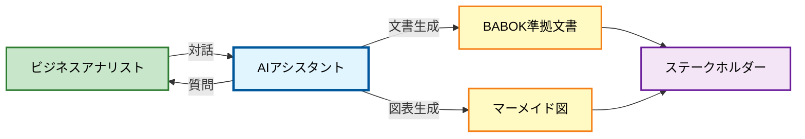

### 3つの特徴

#### 1. インタラクティブ（対話型）
```
❌ 従来: テンプレートを埋める
✅ 新方式: AIと対話しながら作成

例:
🤖 「プロジェクトの目的は何ですか？」
👤 「業務効率化です」
🤖 「現在の業務にどのくらい時間がかかっていますか？
    → 効率化効果の測定基準設定のため」
👤 「1日3時間です」
🤖 「目標とする削減時間は？」
```

#### 2. コンテキストアウェア（文脈理解）
```
回答に応じて次の質問を動的に生成

例:
👤 「売上向上が目的です」
🤖 → 「目標売上増加率は？」（ROI算出のため）

👤 「コスト削減が目的です」
🤖 → 「現在のコストは？」（削減効果測定のため）
```

#### 3. 目的明示型
```
すべての質問に「なぜ必要か」を明示

例:
🤖 「ステークホルダーの影響力は？（高/中/低）
    💡 目的: 優先順位付けのため」

→ BAが質問の意図を理解できる
→ より的確な回答が得られる
```

---

## システム概要

### アーキテクチャ

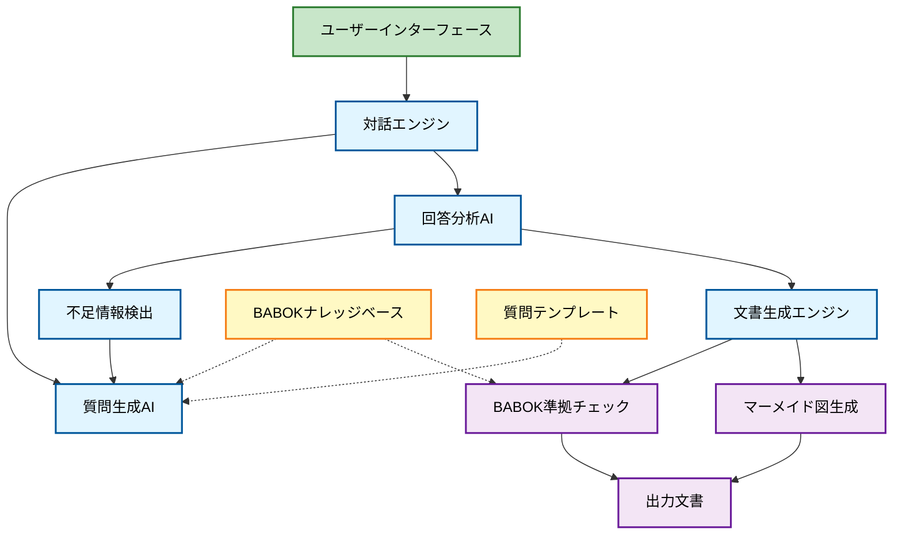

### 主要機能

#### 1. 対話型情報収集
- BABOK知識エリアに基づく質問生成
- 回答に応じた動的な追加質問
- 不足情報の自動検出

#### 2. 文書自動生成
- BABOK準拠の構造化文書
- マーメイド図（フロー、ガント、マトリクス等）
- カスタマイズ可能なテンプレート

#### 3. 品質保証
- BABOK準拠チェック
- 必須項目の充足確認
- 一貫性検証

---

## 実現例

### 例1: ステークホルダー分析

#### 対話フロー
```
🤖 ステークホルダー分析を始めます

❓ 主要なステークホルダーを教えてください
   💡 目的: ステークホルダーマトリクス作成のため

👤 経営層、営業部門、IT部門

🤖 各ステークホルダーについて詳しく教えてください

【経営層について】
❓ 誰が意思決定者ですか？
   💡 目的: 承認プロセスの明確化のため

👤 山田社長

❓ プロジェクトへの関心度は？（高/中/低）
   💡 目的: コミュニケーション頻度の決定のため

👤 高

❓ 影響力は？（高/中/低）
   💡 目的: 優先順位付けのため

👤 高

【営業部門について】
❓ キーパーソンは誰ですか？
   💡 目的: 要求抽出の窓口特定のため

👤 佐藤部長

❓ 現状の課題は何ですか？
   💡 目的: As-Is分析のため

👤 見積作成に時間がかかる

🤖 ⚠️ 追加情報が必要です

❓ 見積作成に何時間かかっていますか？
   💡 目的: 効率化効果の測定基準設定のため

---

## ユーザーヒアリング統合機能

### 概要
MS TeamsとMS Formsを活用した、効率的なユーザーヒアリングと情報整理の統合機能

### システム連携図

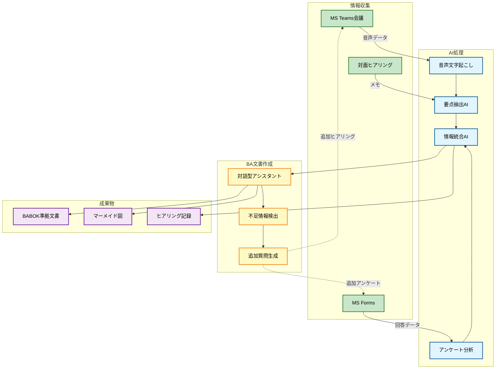

---

### 機能1: MS Teams会議連携

#### 自動文字起こし＆要点抽出

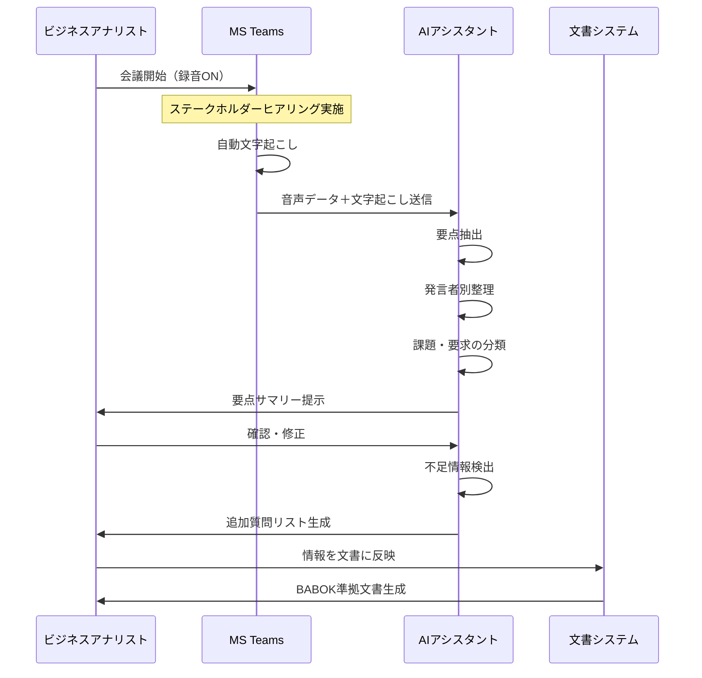

#### 実装例

**Teams会議後の自動処理**
```python
# teams_integration.py

class TeamsIntegration:
    """MS Teams会議連携"""
    
    async def process_meeting_recording(self, meeting_id: str):
        """会議録音を処理"""
        
        # 1. Teams APIから録音データ取得
        recording = await self.get_meeting_recording(meeting_id)
        transcript = await self.get_meeting_transcript(meeting_id)
        
        # 2. AI分析
        analysis = await self.analyze_meeting_content(transcript)
        
        # 3. 要点抽出
        summary = {
            "meeting_info": {
                "date": recording.date,
                "participants": recording.participants,
                "duration": recording.duration
            },
            "key_points": analysis.key_points,
            "requirements": analysis.requirements,
            "pain_points": analysis.pain_points,
            "decisions": analysis.decisions,
            "action_items": analysis.action_items
        }
        
        # 4. 発言者別整理
        speaker_insights = self.organize_by_speaker(transcript, analysis)
        
        # 5. 不足情報検出
        missing_info = self.detect_missing_information(summary)
        
        # 6. 追加質問生成
        follow_up_questions = self.generate_follow_up_questions(missing_info)
        
        return {
            "summary": summary,
            "speaker_insights": speaker_insights,
            "missing_info": missing_info,
            "follow_up_questions": follow_up_questions
        }
    
    async def analyze_meeting_content(self, transcript: str):
        """会議内容をAI分析"""
        
        prompt = f"""
        以下の会議の文字起こしを分析してください：
        
        {transcript}
        
        以下の観点で整理してください：
        1. 重要なポイント（Key Points）
        2. 要求事項（Requirements）
        3. 課題・問題点（Pain Points）
        4. 決定事項（Decisions）
        5. アクションアイテム（Action Items）
        
        BABOK準拠の要求分析の観点で分類してください。
        """
        
        response = await openai.ChatCompletion.create(
            model="gpt-4",
            messages=[{"role": "user", "content": prompt}]
        )
        
        return self.parse_analysis_response(response)
```

#### 生成される要点サマリー例

```markdown
# ヒアリング記録: 営業部門ヒアリング

## 会議情報
- **日時**: 2024年1月15日 14:00-15:30
- **参加者**: 
  - 佐藤部長（営業部門）
  - 田中課長（営業部門）
  - 山田（BA）
- **議題**: 見積システム要件ヒアリング

## 重要なポイント

### 1. 現状の課題
- 見積作成に1件あたり2時間かかる
- 手作業が多く、ミスが発生（月2-3件）
- 過去の見積を探すのに時間がかかる

### 2. 要求事項
- Web上で見積を作成したい
- 過去の見積をテンプレートとして使いたい
- 承認フローを自動化したい
- 顧客に直接見積を送信したい

### 3. 決定事項
- 次回ヒアリング: 1月22日 14:00
- プロトタイプレビュー: 2月5日

## 発言者別インサイト

### 佐藤部長
- **関心事**: コスト削減、業務効率化
- **期待効果**: 見積作成時間を50%削減
- **懸念事項**: システム導入による現場の混乱

### 田中課長
- **関心事**: 使いやすさ、現場の負担軽減
- **具体的要望**: 
  - スマホからも見積作成したい
  - 商品マスタの検索を簡単にしたい
- **懸念事項**: 操作が複雑にならないか

## 不足情報

🔴 **高優先度**
1. 見積の承認フローの詳細
   - 承認者は誰か？
   - 承認基準は？
   - 差し戻しのルールは？

2. 既存システムとの連携
   - 商品マスタはどこにある？
   - 顧客情報はどこから取得？

🟡 **中優先度**
3. 非機能要求
   - 同時アクセス数は？
   - データ保存期間は？

## 次回ヒアリングの質問リスト

### 承認フローについて
❓ 見積の承認者は誰ですか？（役職・人数）
   💡 目的: 承認フロー設計のため

❓ 承認基準を教えてください（金額、商品種別など）
   💡 目的: 自動承認ルール設定のため

❓ 差し戻しが発生した場合の対応は？
   💡 目的: 例外処理設計のため

### システム連携について
❓ 商品マスタはどのシステムで管理していますか？
   💡 目的: データ連携方式の決定のため

❓ 顧客情報はどこから取得しますか？
   💡 目的: マスタ連携設計のため
```

---

### 機能2: MS Forms連携

#### アンケート自動生成＆分析

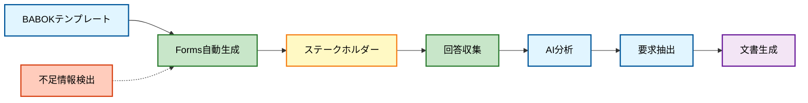

#### Forms自動生成例

**プロジェクト種別に応じたアンケート**

```python
# forms_integration.py

class FormsIntegration:
    """MS Forms連携"""
    
    def generate_stakeholder_survey(self, project_type: str, stakeholder_role: str):
        """ステークホルダー向けアンケート生成"""
        
        # BABOKテンプレートから質問を生成
        questions = self.get_babok_questions(project_type, stakeholder_role)
        
        # MS Forms APIで作成
        form = {
            "title": f"{project_type} - {stakeholder_role}向けアンケート",
            "description": "プロジェクトの要求を整理するためのアンケートです。",
            "questions": questions
        }
        
        form_url = self.create_ms_form(form)
        return form_url
    
    def get_babok_questions(self, project_type: str, role: str):
        """BABOK準拠の質問を生成"""
        
        base_questions = [
            {
                "type": "text",
                "title": "現在の業務で最も時間がかかっている作業は何ですか？",
                "required": True,
                "purpose": "As-Is分析のため"
            },
            {
                "type": "rating",
                "title": "現在の業務プロセスの満足度を教えてください（1-5）",
                "required": True,
                "purpose": "課題の定量化のため"
            },
            {
                "type": "choice",
                "title": "最も改善したい点は何ですか？",
                "choices": [
                    "作業時間の短縮",
                    "ミスの削減",
                    "情報共有の改善",
                    "その他"
                ],
                "required": True,
                "purpose": "優先順位付けのため"
            }
        ]
        
        # 役割別の追加質問
        if role == "経営層":
            base_questions.extend([
                {
                    "type": "text",
                    "title": "このプロジェクトで期待するROIは？",
                    "required": False,
                    "purpose": "投資対効果の測定基準設定のため"
                }
            ])
        elif role == "現場担当者":
            base_questions.extend([
                {
                    "type": "text",
                    "title": "日常業務で困っていることを具体的に教えてください",
                    "required": True,
                    "purpose": "詳細な課題抽出のため"
                }
            ])
        
        return base_questions
    
    async def analyze_survey_responses(self, form_id: str):
        """アンケート回答を分析"""
        
        # MS Forms APIから回答取得
        responses = await self.get_form_responses(form_id)
        
        # AI分析
        analysis = await self.ai_analyze_responses(responses)
        
        return {
            "response_count": len(responses),
            "summary": analysis.summary,
            "common_themes": analysis.themes,
            "priority_requirements": analysis.priorities,
            "pain_points": analysis.pain_points,
            "suggestions": analysis.suggestions
        }
```

#### 生成されるFormsの例

**営業部門向けアンケート**

```
タイトル: 見積システム改善 - 営業部門向けアンケート

説明:
見積システムの改善に向けて、現場の皆様のご意見をお聞かせください。
回答時間: 約10分

━━━━━━━━━━━━━━━━━━━━━━━━━━━━━━━━

【セクション1: 現状について】

Q1. 現在の見積作成プロセスを教えてください *必須
   [長文回答]
   💡 目的: As-Is分析のため

Q2. 1件の見積作成に何分かかりますか？ *必須
   [数値入力] 分
   💡 目的: 効率化効果の測定基準設定のため

Q3. 1日に何件の見積を作成しますか？ *必須
   [数値入力] 件
   💡 目的: 業務量の把握、システム規模の見積もりのため

Q4. 現在の見積作成プロセスの満足度は？ *必須
   ○ 1 - 非常に不満
   ○ 2 - やや不満
   ○ 3 - 普通
   ○ 4 - やや満足
   ○ 5 - 非常に満足
   💡 目的: 課題の定量化のため

━━━━━━━━━━━━━━━━━━━━━━━━━━━━━━━━

【セクション2: 課題について】

Q5. 見積作成で最も困っていることは？ *必須
   ☐ 時間がかかる
   ☐ ミスが発生する
   ☐ 過去の見積を探すのが大変
   ☐ 承認に時間がかかる
   ☐ その他: [記述]
   💡 目的: 課題の特定のため

Q6. ミスはどのくらいの頻度で発生しますか？
   ○ ほぼ毎日
   ○ 週に数回
   ○ 月に数回
   ○ ほとんどない
   💡 目的: 問題の定量化のため

Q7. ミスが発生した場合の影響を教えてください
   [長文回答]
   💡 目的: リスク評価のため

━━━━━━━━━━━━━━━━━━━━━━━━━━━━━━━━

【セクション3: 理想像について】

Q8. 理想的な見積作成プロセスはどうあるべきですか？ *必須
   [長文回答]
   💡 目的: To-Be要求の抽出のため

Q9. 新システムに期待する機能は？ *必須
   ☐ Web上で見積作成
   ☐ 過去見積のテンプレート利用
   ☐ 自動承認フロー
   ☐ 顧客への直接送信
   ☐ スマホ対応
   ☐ その他: [記述]
   💡 目的: 機能要求の抽出のため

Q10. 最も優先度が高い機能は？ *必須
   [Q9の選択肢から1つ選択]
   💡 目的: 優先順位付けのため

━━━━━━━━━━━━━━━━━━━━━━━━━━━━━━━━

【セクション4: その他】

Q11. その他、ご意見・ご要望があれば教えてください
   [長文回答]

━━━━━━━━━━━━━━━━━━━━━━━━━━━━━━━━

ご協力ありがとうございました！
```

#### 回答分析レポート例

```markdown
# アンケート分析レポート

## 回答サマリー
- **配信数**: 20名
- **回答数**: 18名（回答率90%）
- **回答期間**: 2024年1月15日〜1月19日

## 主要な発見

### 1. 現状の課題（定量データ）

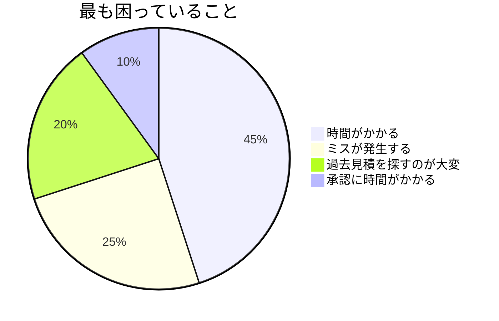

### 2. 作業時間分析
- **平均作成時間**: 118分/件
- **最短**: 60分
- **最長**: 180分
- **1日平均件数**: 4.2件

### 3. 満足度分析
- **平均満足度**: 2.3/5.0
- **不満（1-2）**: 61%
- **普通（3）**: 28%
- **満足（4-5）**: 11%

## 共通テーマ

### テーマ1: 手作業の多さ
**頻出キーワード**: 手入力、コピペ、Excel、計算ミス

**代表的な意見**:
> "商品情報を毎回手入力するのが大変。過去の見積からコピーしているが、
> 古い価格のままになっていることがある"

### テーマ2: 情報の探しにくさ
**頻出キーワード**: 検索、フォルダ、ファイル名、見つからない

**代表的な意見**:
> "過去の見積を探すのに10分以上かかることがある。
> ファイル名の付け方が統一されていない"

### テーマ3: 承認プロセスの非効率
**頻出キーワード**: 承認待ち、印鑑、メール、遅い

**代表的な意見**:
> "部長の承認待ちで1日以上かかることがある。
> 急ぎの見積でも待たされる"

## 優先要求

### 高優先度（80%以上が選択）
1. **Web上で見積作成** - 89%
2. **過去見積のテンプレート利用** - 83%
3. **自動承認フロー** - 78%

### 中優先度（50-80%）
4. **顧客への直接送信** - 67%
5. **スマホ対応** - 56%

## 追加で必要なヒアリング

### 🔴 高優先度
1. **承認フローの詳細**
   - 現在の承認者・承認基準が不明
   - 次回ヒアリングで確認必要

2. **商品マスタの管理方法**
   - 価格情報の更新頻度が不明
   - IT部門へのヒアリング必要

### 🟡 中優先度
3. **顧客への送信方法**
   - メール？PDF？システム連携？
   - 詳細確認が必要
```

---

### 機能3: 統合ワークフロー

#### エンドツーエンドのプロセス

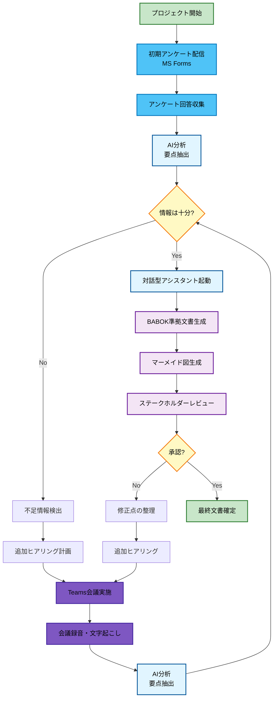

#### 実装例: 統合ワークフロー

```python
# integrated_workflow.py

class IntegratedBAWorkflow:
    """統合BAワークフロー"""
    
    def __init__(self):
        self.forms_integration = FormsIntegration()
        self.teams_integration = TeamsIntegration()
        self.ba_assistant = BADocumentAssistant()
    
    async def start_project(self, project_info: dict):
        """プロジェクト開始"""
        
        # 1. 初期アンケート配信
        print("📋 ステップ1: 初期アンケート配信")
        survey_urls = await self.distribute_initial_surveys(project_info)
        
        # 2. 回答収集・分析
        print("📊 ステップ2: アンケート分析")
        survey_analysis = await self.analyze_surveys(survey_urls)
        
        # 3. 不足情報検出
        print("🔍 ステップ3: 不足情報検出")
        missing_info = self.detect_missing_information(survey_analysis)
        
        # 4. 追加ヒアリング計画
        if missing_info:
            print("📅 ステップ4: 追加ヒアリング実施")
            meeting_insights = await self.conduct_follow_up_meetings(missing_info)
            
            # 情報を統合
            all_information = self.merge_information(
                survey_analysis, 
                meeting_insights
            )
        else:
            all_information = survey_analysis
        
        # 5. BA文書作成
        print("📄 ステップ5: BA文書作成")
        documents = await self.generate_ba_documents(all_information)
        
        # 6. レビュー・承認
        print("✅ ステップ6: レビュー・承認")
        approved_documents = await self.review_and_approve(documents)
        
        return approved_documents
    
    async def distribute_initial_surveys(self, project_info: dict):
        """初期アンケート配信"""
        
        stakeholders = project_info['stakeholders']
        survey_urls = {}
        
        for stakeholder in stakeholders:
            # 役割に応じたアンケート生成
            form_url = self.forms_integration.generate_stakeholder_survey(
                project_type=project_info['type'],
                stakeholder_role=stakeholder['role']
            )
            
            # メール送信
            await self.send_survey_email(
                to=stakeholder['email'],
                form_url=form_url,
                deadline="1週間後"
            )
            
            survey_urls[stakeholder['role']] = form_url
        
        return survey_urls
    
    async def conduct_follow_up_meetings(self, missing_info: dict):
        """追加ヒアリング実施"""
        
        meeting_insights = []
        
        for info_category, details in missing_info.items():
            # Teams会議をスケジュール
            meeting_id = await self.schedule_teams_meeting(
                topic=f"{info_category}に関するヒアリング",
                questions=details['questions']
            )
            
            # 会議実施（手動）
            print(f"⏰ Teams会議をスケジュールしました: {meeting_id}")
            print(f"   質問リスト:")
            for q in details['questions']:
                print(f"   - {q}")
            
            # 会議後の処理（自動）
            # ※実際の会議は手動で実施
            # ※会議終了後、自動的に以下が実行される
            
            # 会議録音を処理
            insights = await self.teams_integration.process_meeting_recording(
                meeting_id
            )
            
            meeting_insights.append(insights)
        
        return meeting_insights
    
    async def generate_ba_documents(self, information: dict):
        """BA文書生成"""
        
        # 対話型アシスタントに情報を投入
        session = self.ba_assistant.create_session(information)
        
        # 不足情報があれば対話で補完
        while not session.is_complete():
            question = session.get_next_question()
            # ※ここでBAが回答
            answer = input(f"{question}\n回答: ")
            session.add_answer(answer)
        
        # 文書生成
        documents = {
            "stakeholder_analysis": session.generate_stakeholder_analysis(),
            "requirements_spec": session.generate_requirements_specification(),
            "process_flow": session.generate_process_flow(),
            "project_schedule": session.generate_project_schedule()
        }
        
        return documents
```

---

### 期待効果（ヒアリング統合機能）

#### 時間削減
| 作業 | 従来 | 統合機能 | 削減率 |
|-----|------|---------|--------|
| **アンケート作成** | 2日 | 10分 | **99%** |
| **回答集計・分析** | 1日 | 10分 | **98%** |
| **会議議事録作成** | 2時間 | 自動 | **100%** |
| **要点整理** | 半日 | 10分 | **96%** |
| **合計** | 約4日 | 約1時間 | **97%** |

#### 品質向上
- ✅ 全ステークホルダーから体系的に情報収集
- ✅ 会議の要点を漏れなく記録
- ✅ 定量データと定性データの統合分析
- ✅ 不足情報の自動検出

#### 使いやすさ
- ✅ 慣れ親しんだMS Teams/Formsを活用
- ✅ 既存ワークフローに自然に統合
- ✅ 追加ツールの学習不要


👤 1件あたり2時間

❓ 1日に何件の見積を作成しますか？
   💡 目的: 業務量の把握、システム規模の見積もりのため

👤 平均5件

🤖 ✅ 情報収集完了
    📄 文書を生成します...
```

#### 生成される文書

**1. ステークホルダーマトリクス**
```markdown
# ステークホルダー分析

## ステークホルダーマトリクス

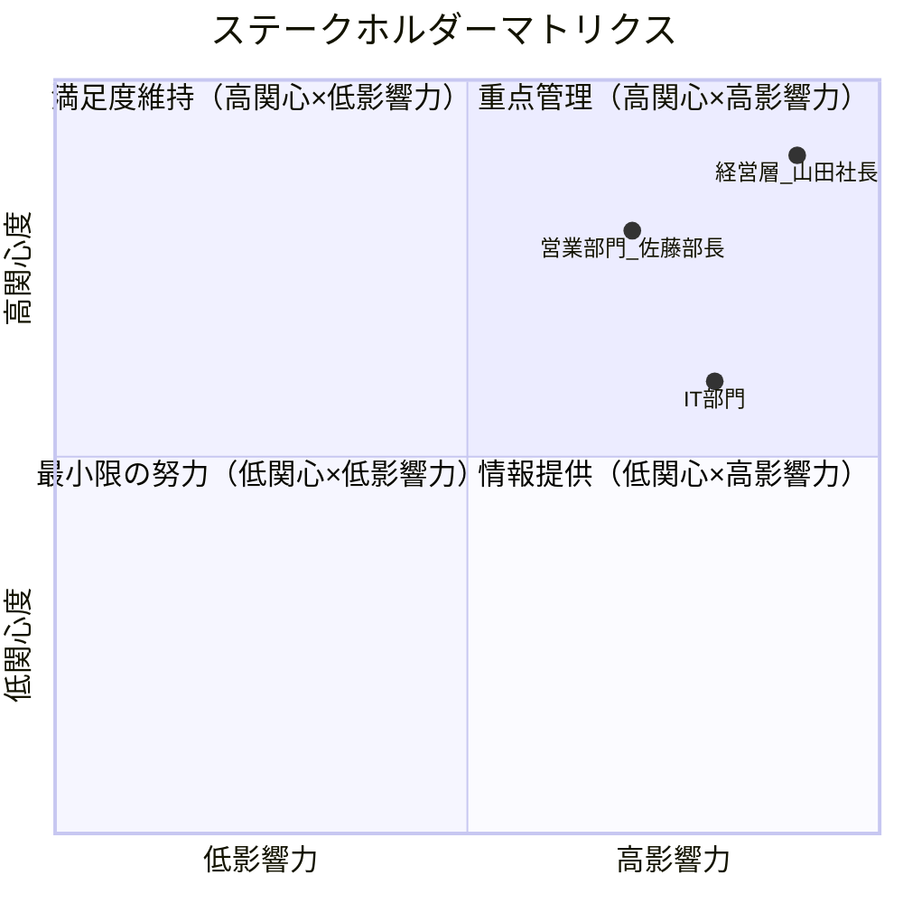

## ステークホルダー詳細

### 経営層（山田社長）
- **役割**: 意思決定者
- **関心度**: 高
- **影響力**: 高
- **対応方針**: 重点管理 - 定期的な進捗報告、重要な意思決定への参画

### 営業部門（佐藤部長）
- **役割**: 主要ユーザー、要求提供者
- **関心度**: 高
- **影響力**: 中
- **現状課題**: 見積作成に時間がかかる（1件2時間、1日5件）
- **期待効果**: 見積作成時間の短縮
- **対応方針**: 満足度維持 - 定期的なヒアリング、UAT参加

### IT部門
- **役割**: 技術実装、運用保守
- **関心度**: 中
- **影響力**: 高
- **対応方針**: 情報提供 - 技術仕様の共有、実装支援
```

**2. 課題分析**
```markdown
## 現状課題の定量分析

### 営業部門の課題
- **課題**: 見積作成に時間がかかる
- **現状**: 1件あたり2時間
- **業務量**: 1日5件
- **月間工数**: 2時間 × 5件 × 20日 = 200時間/月
- **年間工数**: 2,400時間/年

### 改善目標
- **目標**: 見積作成時間を50%削減
- **期待効果**: 1,200時間/年の削減
- **金銭換算**: 約600万円/年（時給5,000円換算）
```

---

### 例2: 要求定義

#### 対話フロー
```
🤖 要求定義を始めます

【現状分析（As-Is）】
❓ 現在の業務プロセスを教えてください
   💡 目的: As-Is分析のため

👤 顧客から電話で注文を受ける
   → 手書きで伝票に記入
   → FAXで倉庫に送信
   → 倉庫から電話で在庫確認
   → 顧客に納期を連絡

🤖 ⚠️ 課題を検出しました
    - 手書き → 転記ミスのリスク
    - 電話/FAX → 記録が残らない
    - 手作業が多い → 時間がかかる

❓ 転記ミスはどのくらいの頻度で発生しますか？
   💡 目的: 問題の定量化、改善効果の測定のため

👤 月に2-3件

❓ ミスが発生した場合の影響は？
   💡 目的: リスク評価のため

👤 誤配送、顧客クレーム、再配送コスト

【理想像（To-Be）】
❓ 理想的には、どのように改善したいですか？
   💡 目的: To-Be要求の抽出のため

👤 Webで注文を受けて、自動で在庫確認、
   すぐに納期を回答したい

🤖 ✅ 機能要求を抽出しました
    1. Web注文受付機能
    2. 在庫自動確認機能
    3. 納期自動計算機能

❓ これらの機能で正しいですか？追加・修正はありますか？
   💡 目的: 要求の確認と精緻化のため

👤 はい、それに加えて注文履歴も見たいです

🤖 ✅ 追加しました
    4. 注文履歴照会機能

【非機能要求】
❓ 同時に何人がアクセスする想定ですか？
   💡 目的: 性能要求の定義のため

👤 ピーク時で50人

❓ システムの稼働時間は？
   💡 目的: 可用性要求の定義のため

👤 24時間365日

❓ 顧客情報を扱うため、セキュリティ要件は？
   💡 目的: セキュリティ要求の定義のため

👤 個人情報保護法に準拠、SSL通信必須

🤖 ✅ 要求定義完了
    📄 文書を生成します...
```

#### 生成される文書

**1. As-Is/To-Beフロー**
```markdown
# 業務プロセス分析

## As-Is（現状）

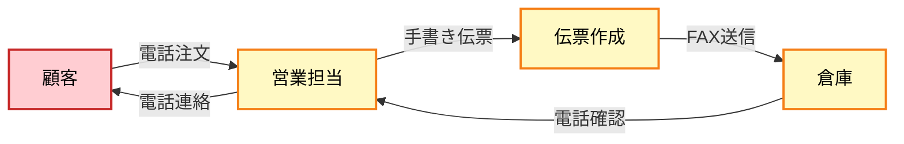

### 現状の課題
1. **転記ミス**: 手書き伝票により月2-3件発生
2. **記録なし**: 電話/FAXのため履歴が残らない
3. **時間がかかる**: 手作業が多く非効率
4. **顧客満足度**: 即座に納期回答できない

### 課題の影響
- 誤配送による顧客クレーム
- 再配送コストの発生
- 業務効率の低下

## To-Be（理想）

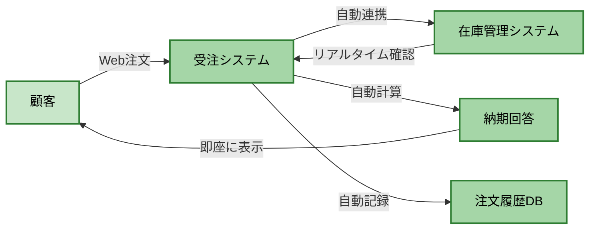

### 期待効果
1. **転記ミスゼロ**: 手入力を排除
2. **記録保持**: すべての注文を自動記録
3. **効率化**: 自動化により処理時間短縮
4. **顧客満足度向上**: 即座に納期回答
```

**2. 要求仕様書**
```markdown
# 要求仕様書

## 1. 機能要求

### FR-001: Web注文受付機能
- **優先度**: 高
- **説明**: 顧客がWebブラウザから注文を入力できる
- **受入基準**:
  - 商品検索ができる
  - 数量を指定できる
  - 配送先を入力できる
  - 注文確定ボタンで注文が完了する

### FR-002: 在庫自動確認機能
- **優先度**: 高
- **説明**: 注文時に在庫を自動確認する
- **受入基準**:
  - リアルタイムで在庫数を確認
  - 在庫不足の場合は警告表示
  - 在庫引当を自動実行

### FR-003: 納期自動計算機能
- **優先度**: 高
- **説明**: 在庫状況に基づき納期を自動計算
- **受入基準**:
  - 在庫ありの場合: 翌営業日
  - 在庫なしの場合: 入荷予定日+2日
  - 納期を注文画面に表示

### FR-004: 注文履歴照会機能
- **優先度**: 中
- **説明**: 過去の注文履歴を照会できる
- **受入基準**:
  - 過去1年分の注文を表示
  - 注文番号、日付、商品、金額を表示
  - 注文詳細を確認できる

## 2. 非機能要求

### NFR-001: 性能要求
- **同時アクセス数**: 50ユーザー
- **応答時間**: 3秒以内（通常時）
- **スループット**: 100注文/時間

### NFR-002: 可用性要求
- **稼働時間**: 24時間365日
- **目標稼働率**: 99.9%
- **計画停止**: 月1回、深夜2時間以内

### NFR-003: セキュリティ要求
- **準拠法規**: 個人情報保護法
- **通信**: SSL/TLS暗号化必須
- **認証**: ユーザーID/パスワード
- **アクセスログ**: すべての操作を記録

### NFR-004: 保守性要求
- **ログ保存**: 1年間
- **バックアップ**: 日次、世代管理
- **監視**: 24時間システム監視
```

---

### 例3: プロジェクト計画

#### 対話フロー
```
🤖 プロジェクト計画を作成します

❓ プロジェクトの開始予定日は？
   💡 目的: スケジュール計画のため

👤 2024年4月1日

❓ 希望納期（本番稼働日）は？
   💡 目的: マイルストーン設定のため

👤 2024年9月30日

🤖 ✅ プロジェクト期間: 6ヶ月

❓ 開発手法は？（ウォーターフォール/アジャイル）
   💡 目的: フェーズ構成の決定のため

👤 ウォーターフォール

🤖 ✅ PMBOK準拠のフェーズ構成で計画します

❓ 月次のステアリングコミッティは必要ですか？
   💡 目的: ガバナンス計画のため

👤 はい、毎月15日に実施

🤖 ✅ プロジェクト計画を生成します...
```

#### 生成される文書

```markdown
# プロジェクト計画

## プロジェクトスケジュール

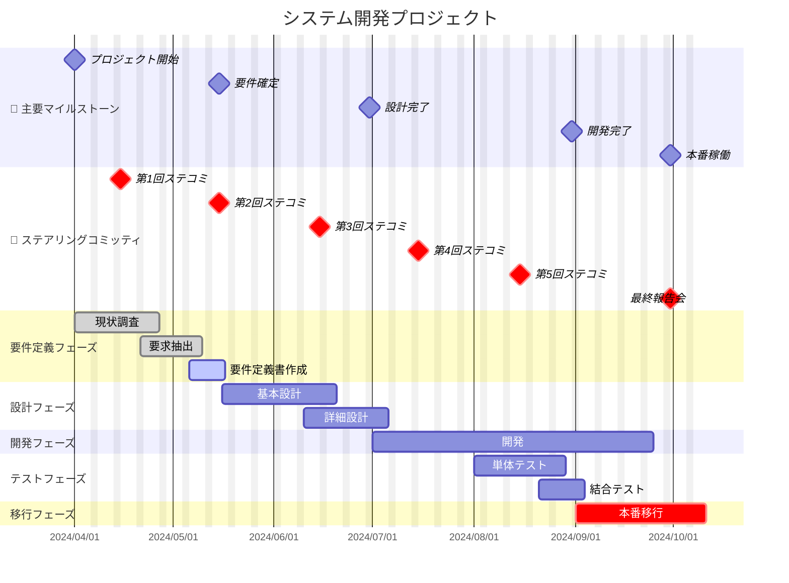

## フェーズ別詳細

### フェーズ1: 要件定義（4/1〜5/15）
- **期間**: 45日
- **成果物**: 要件定義書、ステークホルダー分析
- **承認ゲート**: 第2回ステコミ（5/15）

### フェーズ2: 設計（5/16〜6/30）
- **期間**: 45日
- **成果物**: 基本設計書、詳細設計書
- **承認ゲート**: 第3回ステコミ（6/15）

### フェーズ3: 開発（7/1〜8/31）
- **期間**: 62日
- **成果物**: プログラム、単体テスト結果
- **承認ゲート**: 第5回ステコミ（8/15）

### フェーズ4: テスト（8/1〜8/31）
- **期間**: 30日（開発と並行）
- **成果物**: テスト結果報告書
- **承認ゲート**: 本番移行判定会議

### フェーズ5: 移行（9/1〜9/30）
- **期間**: 30日
- **成果物**: 本番環境、運用マニュアル
- **承認ゲート**: 最終報告会（9/30）
```

---

## 期待効果

### 定量効果

#### 時間削減
| 作業 | 従来 | 新方式 | 削減率 |
|-----|------|--------|--------|
| **要求ヒアリング** | 2週間 | 2日 | **85%** |
| **文書作成** | 1週間 | 1時間 | **95%** |
| **レビュー・修正** | 3日 | 半日 | **83%** |
| **合計** | 約4週間 | 約3日 | **90%** |

#### コスト削減
```
前提:
- BAの時給: 5,000円
- プロジェクト数: 年間10件

従来: 4週間 × 40時間 × 5,000円 × 10件 = 8,000,000円/年
新方式: 3日 × 8時間 × 5,000円 × 10件 = 1,200,000円/年

削減額: 6,800,000円/年（85%削減）
```

### 定性効果

#### 品質向上
- ✅ BABOK準拠が自動保証
- ✅ 必要情報の漏れ防止
- ✅ 一貫性のある文書
- ✅ 標準化による品質の均一化

#### 生産性向上
- ✅ BAは分析に集中できる
- ✅ ステークホルダーとの対話時間が増える
- ✅ 手戻りの削減
- ✅ 属人化の解消

#### ナレッジ共有
- ✅ ベストプラクティスの蓄積
- ✅ 新人BAの育成期間短縮
- ✅ 組織全体のスキル向上

---

## 実装ロードマップ

### フェーズ1: MVP（最小実行可能製品）
**期間**: 3ヶ月

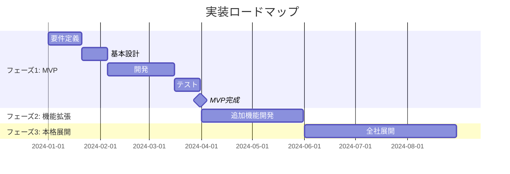

#### 機能スコープ
- ✅ 基本的な対話機能
- ✅ ステークホルダー分析
- ✅ 要求定義（As-Is/To-Be）
- ✅ マーメイド図生成（フロー、マトリクス）
- ✅ Markdown文書出力

#### 技術スタック
- **フロントエンド**: React/Next.js
- **バックエンド**: Python/FastAPI
- **AI**: OpenAI GPT-4 API
- **データベース**: PostgreSQL
- **デプロイ**: Docker/Kubernetes

### フェーズ2: 機能拡張
**期間**: 2ヶ月

#### 追加機能
- ✅ プロジェクト計画（ガントチャート）
- ✅ リスク分析
- ✅ Excel連携（インポート/エクスポート）
- ✅ テンプレートカスタマイズ
- ✅ 多言語対応

### フェーズ3: 本格展開
**期間**: 3ヶ月

#### 展開活動
- ✅ 全社トレーニング
- ✅ 既存プロジェクトへの適用
- ✅ フィードバック収集・改善
- ✅ ベストプラクティス共有

---

## 技術詳細

### システム構成図

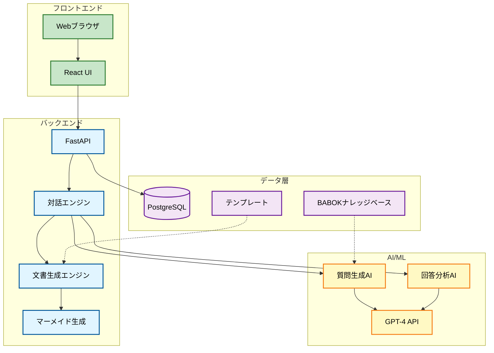

### API設計例

```python
# FastAPI エンドポイント例

@app.post("/api/session/start")
async def start_session(project_type: str):
    """対話セッション開始"""
    session_id = create_session()
    initial_questions = generate_initial_questions(project_type)
    return {"session_id": session_id, "questions": initial_questions}

@app.post("/api/session/{session_id}/answer")
async def submit_answer(session_id: str, answer: Answer):
    """回答を送信し、次の質問を取得"""
    save_answer(session_id, answer)
    missing_info = analyze_answer(answer)
    next_questions = generate_follow_up_questions(missing_info)
    return {"questions": next_questions, "completion": calculate_completion()}

@app.post("/api/document/generate")
async def generate_document(session_id: str, doc_type: str):
    """文書生成"""
    session_data = get_session_data(session_id)
    document = generate_babok_document(session_data, doc_type)
    mermaid_diagrams = generate_mermaid_diagrams(session_data)
    return {"document": document, "diagrams": mermaid_diagrams}
```

---

## まとめ

### 🎯 核心価値
```
「BAの時間を、文書作成（Writing）から分析（Thinking）へシフト」
```

### 📊 期待効果
- ⏱️ 文書作成時間 **90%削減**
- 💰 年間コスト **680万円削減**（10PJ想定）
- 📈 品質の **標準化・向上**
- 🎓 新人BA育成期間 **50%短縮**

### 🚀 次のステップ
1. **MVP開発**: 3ヶ月でプロトタイプ完成
2. **パイロット運用**: 2プロジェクトで試験運用
3. **本格展開**: 全社展開・継続改善

### 💡 成功の鍵
- ✅ BABOK準拠の質問テンプレート整備
- ✅ AIの回答分析精度向上
- ✅ ユーザーフィードバックの継続的反映
- ✅ 組織文化への定着支援

---

## 付録

### A. 参考資料
- BABOK® Guide v3
- IIBA公式ドキュメント
- マーメイド公式ドキュメント

### B. 用語集
- **BABOK**: Business Analysis Body of Knowledge
- **IIBA**: International Institute of Business Analysis
- **BA**: Business Analyst（ビジネスアナリスト）
- **MVP**: Minimum Viable Product（最小実行可能製品）

### C. お問い合わせ
プロジェクトに関するご質問・ご相談は、プロジェクトチームまでお問い合わせください。

---

**文書バージョン**: 1.0  
**作成日**: 2024年1月  
**最終更新**: 2024年1月