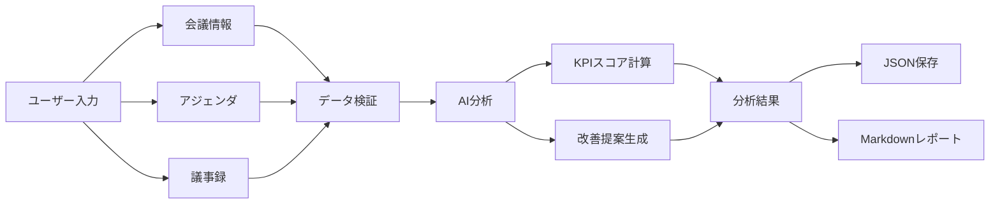

# データモデル設計 - Meeting Intelligence Dashboard

## 📊 概要

本ドキュメントでは、Meeting Intelligence Dashboardで使用するデータ構造を定義します。

MVPでは、AIの分析結果をそのまま保存・表示するのではなく、入力品質や推定値の性質を明示したうえで、保存用途と表示用途を意識した構造に正規化する方針を採用します。

---

## 🗂️ データ構造

### 1. 会議データ（MeetingData）

```json
{
  "meeting_id": "mtg_20240115_001",
  "version": "1.0",
  "created_at": "2024-01-15T14:00:00Z",
  "updated_at": "2024-01-15T15:30:00Z",
  
  "meeting_info": {
    "title": "週次定例会議",
    "date": "2024-01-15",
    "time": "14:00",
    "duration_minutes": 60,
    "participants": [
      {
        "name": "田中太郎",
        "role": "プロジェクトマネージャー",
        "email": "tanaka@example.com"
      },
      {
        "name": "佐藤花子",
        "role": "エンジニア",
        "email": "sato@example.com"
      },
      {
        "name": "鈴木一郎",
        "role": "デザイナー",
        "email": "suzuki@example.com"
      }
    ],
    "facilitator": "田中太郎",
    "location": "オンライン（Teams）"
  },
  
  "pre_meeting": {
    "agenda": [
      {
        "order": 1,
        "title": "プロジェクト進捗報告",
        "description": "各タスクの完了状況を共有し、遅延タスクの特定と対策を決定する",
        "allocated_minutes": 10,
        "owner": "田中太郎"
      },
      {
        "order": 2,
        "title": "技術的課題の検討",
        "description": "API設計の方針を決定し、設計案の承認と次週の実装開始を目指す",
        "allocated_minutes": 30,
        "owner": "佐藤花子"
      },
      {
        "order": 3,
        "title": "次週のアクション決定",
        "description": "担当者と期限を明確化する",
        "allocated_minutes": 20,
        "owner": "田中太郎"
      }
    ],
    "materials": [
      {
        "title": "進捗レポート",
        "url": "https://box.com/files/progress-report.pdf",
        "shared_at": "2024-01-13T10:00:00Z"
      },
      {
        "title": "API設計案",
        "url": "https://box.com/files/api-design.md",
        "shared_at": "2024-01-13T15:00:00Z"
      }
    ],
    "advance_notice_hours": 48,
    "materials_provided": true,
    "pre_questions": [
      {
        "author": "佐藤花子",
        "question": "API設計案のエンドポイント数は適切ですか？",
        "timestamp": "2024-01-14T16:00:00Z"
      }
    ]
  },
  
  "transcript": {
    "raw_text": "田中: 本日のアジェンダは3つです。まず進捗報告から始めます。\n\n佐藤: タスクAは完了しました。タスクBは遅延しています。原因は...\n\n鈴木: タスクBについて、別のアプローチを提案します。具体的には...",
    "word_count": 1234,
    "estimated_speaking_time_minutes": 58,
    "language": "ja"
  },
  
  "analysis_result": {
    "analyzed_at": "2024-01-15T15:35:00Z",
    "ai_model": "gpt-4",
    "analysis_version": "1.0",
    "analysis_confidence": "medium",
    "data_quality_flags": [
      "silence_estimated_from_textual_cues"
    ],
    "assumptions": [
      "沈黙時間は議事録中の記述から推定",
      "発言割合は話者ごとの文字数から推定"
    ],
    
    "overall_score": 72,
    "grade": "B",
    "grade_description": "良好な会議",
    
    "kpi_scores": {
      "pre_meeting_readiness": {
        "score": 75,
        "max_score": 100,
        "target": 80,
        "gap": -5,
        "grade": "B",
        "breakdown": {
          "agenda_clarity": 30,
          "materials_quality": 28,
          "advance_sharing": 17
        }
      },
      "decision_density": {
        "score": 60,
        "max_score": 100,
        "target": 70,
        "gap": -10,
        "grade": "C",
        "breakdown": {
          "decision_count": 25,
          "specificity": 35
        }
      },
      "voice_diversity": {
        "score": 90,
        "max_score": 100,
        "target": 75,
        "gap": 15,
        "grade": "A",
        "breakdown": {
          "distribution": 45,
          "critical_opinions": 28,
          "participation_rate": 17
        }
      },
      "silent_cost_reduction": {
        "score": 70,
        "max_score": 100,
        "target": 85,
        "gap": -15,
        "grade": "B",
        "breakdown": {
          "silence_ratio": 42,
          "context_quality": 28
        }
      },
      "agenda_adherence": {
        "score": 65,
        "max_score": 100,
        "target": 80,
        "gap": -15,
        "grade": "C",
        "breakdown": {
          "completion_rate": 33,
          "off_topic_reduction": 18,
          "time_allocation": 14
        }
      }
    },
    
    "decisions": [
      {
        "id": "dec_001",
        "content": "新機能「ダッシュボード」の開発を開始する",
        "category": "開発",
        "assignees": ["田中太郎", "佐藤花子"],
        "deadline": "2024-01-31",
        "deadline_type": "fixed",
        "priority": "high",
        "specificity_score": 8,
        "specificity_breakdown": {
          "what": 4,
          "who": 4,
          "when": 4,
          "why": 3
        },
        "context": "ユーザーからの要望が多く、競合優位性につながるため",
        "next_review": "2024-01-22"
      },
      {
        "id": "dec_002",
        "content": "API設計の方針を承認",
        "category": "設計",
        "assignees": ["佐藤花子"],
        "deadline": "2024-01-22",
        "deadline_type": "fixed",
        "priority": "high",
        "specificity_score": 9,
        "specificity_breakdown": {
          "what": 5,
          "who": 4,
          "when": 4,
          "why": 4
        },
        "context": "事前に共有した設計案を承認し、実装フェーズに移行",
        "next_review": "2024-01-22"
      },
      {
        "id": "dec_003",
        "content": "次回会議の日程調整",
        "category": "運営",
        "assignees": [],
        "deadline": null,
        "deadline_type": "unspecified",
        "priority": "low",
        "specificity_score": 3,
        "specificity_breakdown": {
          "what": 2,
          "who": 0,
          "when": 0,
          "why": 1
        },
        "context": "時間切れで詳細が決まらなかった",
        "issues": ["担当者未定", "期限未定"]
      }
    ],
    
    "voice_analysis": {
      "speaker_distribution": {
        "田中太郎": {
          "percentage": 45,
          "estimated_minutes": 27,
          "turn_count": 15
        },
        "佐藤花子": {
          "percentage": 35,
          "estimated_minutes": 21,
          "turn_count": 12
        },
        "鈴木一郎": {
          "percentage": 20,
          "estimated_minutes": 12,
          "turn_count": 8
        }
      },
      "gini_coefficient": 0.25,
      "gini_interpretation": "やや偏りあり",
      "critical_opinions": [
        {
          "speaker": "鈴木一郎",
          "content": "タスクBのアプローチには懸念があります",
          "timestamp": "14:25",
          "type": "concern",
          "impact": "high"
        },
        {
          "speaker": "佐藤花子",
          "content": "別の視点では、リスクとして〇〇が考えられます",
          "timestamp": "14:40",
          "type": "risk_identification",
          "impact": "medium"
        }
      ],
      "silent_participants": [],
      "participation_rate": 100
    },
    
    "silent_periods": [
      {
        "id": "silence_001",
        "start_time": "14:15",
        "end_time": "14:18",
        "duration_seconds": 180,
        "context": "質問後の沈黙",
        "context_type": "awkward",
        "preceding_text": "田中: この点について、どう思いますか？",
        "issue": true
      },
      {
        "id": "silence_002",
        "start_time": "14:35",
        "end_time": "14:37",
        "duration_seconds": 120,
        "context": "考える時間",
        "context_type": "productive",
        "preceding_text": "佐藤: 少し考えさせてください",
        "issue": false
      },
      {
        "id": "silence_003",
        "start_time": "14:50",
        "end_time": "14:51",
        "duration_seconds": 60,
        "context": "資料確認",
        "context_type": "productive",
        "preceding_text": "田中: この図を見てください",
        "issue": false
      }
    ],
    "total_silence_seconds": 360,
    "silence_percentage": 10,
    "problematic_silence_seconds": 180,
    
    "agenda_coverage": {
      "items": [
        {
          "agenda_id": 1,
          "title": "プロジェクト進捗報告",
          "status": "completed",
          "allocated_minutes": 10,
          "actual_minutes": 12,
          "variance_minutes": 2,
          "variance_percentage": 20,
          "completion_percentage": 100
        },
        {
          "agenda_id": 2,
          "title": "技術的課題の検討",
          "status": "completed",
          "allocated_minutes": 30,
          "actual_minutes": 35,
          "variance_minutes": 5,
          "variance_percentage": 17,
          "completion_percentage": 100
        },
        {
          "agenda_id": 3,
          "title": "次週のアクション決定",
          "status": "incomplete",
          "allocated_minutes": 20,
          "actual_minutes": 0,
          "variance_minutes": -20,
          "variance_percentage": -100,
          "completion_percentage": 0,
          "reason": "時間切れ"
        }
      ],
      "completed_count": 2,
      "total_count": 3,
      "completion_rate": 67,
      "off_topic_minutes": 12,
      "off_topic_percentage": 20,
      "off_topic_topics": [
        {
          "topic": "来週の休暇予定",
          "duration_minutes": 5,
          "timestamp": "14:20"
        },
        {
          "topic": "新しいツールの雑談",
          "duration_minutes": 7,
          "timestamp": "14:45"
        }
      ]
    },
    
    "recommendations": [
      {
        "id": "rec_001",
        "category": "事前準備",
        "priority": "high",
        "kpi_target": "pre_meeting_readiness",
        "current_issue": "事前資料が不足しており、会議の30%が説明に費やされています",
        "suggestion": "Box上に資料を48時間前に配置し、資料に「事前に考えてほしいポイント」を明記してください",
        "action_items": [
          "Box上に資料を48時間前に配置",
          "資料に「事前に考えてほしいポイント」を明記",
          "参加者に事前確認を依頼（Teamsメンション）"
        ],
        "expected_impact": {
          "time_saved_minutes": 20,
          "score_improvement": 15,
          "description": "会議時間を20分短縮、事前準備度スコアが+15点向上"
        }
      },
      {
        "id": "rec_002",
        "category": "決定プロセス",
        "priority": "medium",
        "kpi_target": "decision_density",
        "current_issue": "決定事項に担当者と期限が明記されていません",
        "suggestion": "決定テンプレートを使用し、会議の最後5分を「決定事項の確認」に充ててください",
        "action_items": [
          "決定テンプレートを使用（What/Who/When）",
          "会議の最後5分を「決定事項の確認」に充てる",
          "決定事項を即座にタスク管理ツールに登録"
        ],
        "expected_impact": {
          "execution_rate_improvement": 30,
          "score_improvement": 20,
          "description": "実行率が90%以上に向上、決定密度スコアが+20点向上"
        }
      },
      {
        "id": "rec_003",
        "category": "時間管理",
        "priority": "medium",
        "kpi_target": "agenda_adherence",
        "current_issue": "アジェンダ3が未消化で、予定外の議論に12分使いました",
        "suggestion": "タイムキーパーを設定し、脱線したら「別途時間を設けましょう」と介入してください",
        "action_items": [
          "タイムキーパーを設定",
          "各アジェンダの開始時に残り時間を宣言",
          "予定時間の80%で「まとめに入ります」と宣言"
        ],
        "expected_impact": {
          "time_saved_minutes": 15,
          "score_improvement": 15,
          "description": "会議時間を15分短縮、アジェンダ遵守度が+15点向上"
        }
      }
    ],
    
    "highlights": {
      "strengths": [
        "発言の多様性が高く、全員が積極的に参加",
        "批判的意見が2件あり、リスクの早期発見につながった",
        "事前質問があり、準備意識が高い"
      ],
      "weaknesses": [
        "決定事項の具体性が不足（担当者・期限が不明確）",
        "アジェンダの1つが未消化",
        "予定外の議論に20%の時間を使用"
      ],
      "risks": [
        "未消化のアジェンダ項目が次回に持ち越される",
        "決定事項の実行が曖昧になる可能性"
      ],
      "opportunities": [
        "事前準備を強化すれば、会議時間を30%削減可能",
        "決定プロセスを標準化すれば、実行率が大幅に向上"
      ]
    }
  },
  
  "metadata": {
    "app_version": "1.0.0",
    "data_schema_version": "1.0",
    "export_format": "json",
    "file_size_bytes": 15234,
    "checksum": "abc123def456"
  }
}
```

---

## 📋 データ型定義

### 基本型

```typescript
// 会議ID
type MeetingId = string; // 形式: "mtg_YYYYMMDD_NNN"

// 日付・時刻
type DateString = string; // 形式: "YYYY-MM-DD"
type TimeString = string; // 形式: "HH:MM"
type ISODateTime = string; // 形式: ISO 8601

// スコア
type Score = number; // 0-100
type Grade = "S" | "A" | "B" | "C" | "D" | "E";
type Confidence = "high" | "medium" | "low";

// 優先度
type Priority = "high" | "medium" | "low";

// ステータス
type Status = "completed" | "incomplete" | "in_progress";
```

### 複合型

```typescript
interface Participant {
  name: string;
  role?: string;
  email?: string;
}

interface AgendaItem {
  order: number;
  title: string;
  description: string;
  allocated_minutes: number;
  owner: string;
}

interface Material {
  title: string;
  url: string;
  shared_at: ISODateTime;
}

interface Decision {
  id: string;
  content: string;
  category: string;
  assignees: string[];
  deadline: DateString | null;
  deadline_type: "fixed" | "flexible" | "unspecified";
  priority: Priority;
  specificity_score: number;
  specificity_breakdown: {
    what: number;
    who: number;
    when: number;
    why: number;
  };
  context: string;
  next_review?: DateString;
  issues?: string[];
}

interface KPIScore {
  score: Score;
  max_score: number;
  target: number;
  gap: number;
  grade: Grade;
  breakdown: Record<string, number>;
}

interface Recommendation {
  id: string;
  category: string;
  priority: Priority;
  kpi_target: string;
  current_issue: string;
  suggestion: string;
  action_items: string[];
  expected_impact: {
    time_saved_minutes?: number;
    score_improvement?: number;
    execution_rate_improvement?: number;
    description: string;
  };
}

interface AnalysisQuality {
  analysis_confidence: Confidence;
  data_quality_flags: string[];
  assumptions: string[];
}

interface AnalysisQuality {
  analysis_confidence: Confidence;
  data_quality_flags: string[];
  assumptions: string[];
}
```

---

## 🔄 データフロー

### 1. 入力データ → 分析データ



### 2. データ保存形式

#### ローカルストレージ（ブラウザ）

MVPではローカルストレージの保存対象を最小化し、一覧表示に必要なサマリーデータと、必要に応じた詳細データを分けて扱うことを推奨します。

```javascript
// キー: "meeting_history"
// 値: MeetingSummary[]
localStorage.setItem('meeting_history', JSON.stringify(meetings));
```

#### 保存モデルの方針

**1. サマリー保存（デフォルト）**
- `meeting_id`
- `meeting_info.title`
- `meeting_info.date`
- `meeting_info.duration_minutes`
- `analysis_result.overall_score`
- `analysis_result.grade`
- `analysis_result.kpi_scores`
- `analysis_result.recommendations`
- `created_at`

**2. 詳細保存（オプション）**
- 議事録全文
- 事前資料URL
- 発言分析詳細
- 沈黙区間詳細

**設計意図**
- ローカルストレージ容量の節約
- 個人情報・機微情報の過剰保持を防ぐ
- 履歴一覧の表示を高速化する
- 事前資料URL
- 発言分析詳細
- 沈黙区間詳細

**設計意図**
- ローカルストレージ容量の節約
- 個人情報・機微情報の過剰保持を防ぐ
- 履歴一覧の表示を高速化する

#### エクスポート形式

**JSON形式**:
```json
{
  "meeting_id": "mtg_20240115_001",
  "meeting_info": {...},
  "analysis_result": {...}
}
```

**Markdown形式**:
```markdown
# 会議分析レポート

## 会議情報
- 会議名: 週次定例会議
- 日時: 2024-01-15 14:00
- 参加者: 田中太郎, 佐藤花子, 鈴木一郎

## 総合評価
- スコア: 72/100
- 評価: B（良好な会議）

## KPI詳細
...
```

---

## 🎯 バリデーションルール

### 必須フィールド

```javascript
const requiredFields = {
  meeting_info: {
    title: "会議名は必須です",
    date: "日付は必須です",
    time: "時刻は必須です",
    duration_minutes: "会議時間は必須です",
    participants: "参加者は1名以上必要です"
  },
  transcript: {
    raw_text: "議事録テキストは必須です（最低500文字推奨）"
  }
};
```

### データ制約

```javascript
const constraints = {
  duration_minutes: {
    min: 5,
    max: 480, // 8時間
    message: "会議時間は5分〜8時間の範囲で入力してください"
  },
  participants: {
    min: 1,
    max: 50,
    message: "参加者は1〜50名の範囲で入力してください"
  },
  transcript_length: {
    min: 100,
    recommended: 500,
    message: "議事録は100文字以上、500文字以上を推奨します"
  },
  score: {
    min: 0,
    max: 100,
    message: "スコアは0〜100の範囲です"
  }
};
```

---

## 📐 推定値の扱い

MVPでは、議事録テキストのみから推定される値と、入力データから比較的直接求められる値を区別して扱います。

### 推定値として扱う主な項目
- `voice_analysis.speaker_distribution`
- `voice_analysis.gini_coefficient`
- `silent_periods`
- `total_silence_seconds`
- `silence_percentage`
- `agenda_coverage.actual_minutes`
- `agenda_coverage.off_topic_minutes`

### 設計ルール
- UI表示時に必要に応じて「推定」ラベルを付与する
- 推定精度に強く依存する場合は `data_quality_flags` に明記する
- 話者不明、アジェンダ欠落、短すぎる議事録などは `analysis_confidence` を下げる要因とする

### 代表的な品質フラグ例
```typescript
type DataQualityFlag =
  | "agenda_missing"
  | "transcript_too_short"
  | "speakers_not_clearly_identified"
  | "silence_estimated_from_textual_cues"
  | "decision_evidence_weak";
```

---

## 🔐 データセキュリティ

### 個人情報の取り扱い

```javascript
// 個人情報を含むフィールド
const personalDataFields = [
  "participants[].name",
  "participants[].email",
  "decisions[].assignees"
];

// エクスポート時の匿名化オプション
function anonymizeData(data, options = {}) {
  if (options.anonymize) {
    // 名前を匿名化
    data.participants = data.participants.map((p, i) => ({
      ...p,
      name: `参加者${i + 1}`,
      email: undefined
    }));
  }
  return data;
}
```

### ローカルストレージの制限

```javascript
// ブラウザのローカルストレージ制限: 約5-10MB
// 会議データ1件あたり: 約15KB
// 保存可能な会議数: 約300-600件

const STORAGE_LIMIT = 5 * 1024 * 1024; // 5MB
const MAX_MEETINGS = 500;

function checkStorageLimit() {
  const used = new Blob([localStorage.getItem('meeting_history')]).size;
  const percentage = (used / STORAGE_LIMIT) * 100;
  
  if (percentage > 80) {
    console.warn('ストレージ使用率が80%を超えています');
  }
}
```

---

## 📐 推定値の扱い

MVPでは、議事録テキストのみから推定される値と、入力データから比較的直接求められる値を区別して扱います。

### 推定値として扱う主な項目
- `voice_analysis.speaker_distribution`
- `voice_analysis.gini_coefficient`
- `silent_periods`
- `total_silence_seconds`
- `silence_percentage`
- `agenda_coverage.actual_minutes`
- `agenda_coverage.off_topic_minutes`

### 設計ルール
- UI表示時に必要に応じて「推定」ラベルを付与する
- 推定精度に強く依存する場合は `data_quality_flags` に明記する
- 話者不明、アジェンダ欠落、短すぎる議事録などは `analysis_confidence` を下げる要因とする

### 代表的な品質フラグ例
```typescript
type DataQualityFlag =
  | "agenda_missing"
  | "transcript_too_short"
  | "speakers_not_clearly_identified"
  | "silence_estimated_from_textual_cues"
  | "decision_evidence_weak";
```

---

## 📊 サンプルデータ

### 最小限のデータ（必須項目のみ）

```json
{
  "meeting_id": "mtg_20240115_001",
  "meeting_info": {
    "title": "週次定例会議",
    "date": "2024-01-15",
    "time": "14:00",
    "duration_minutes": 60,
    "participants": [
      {"name": "田中太郎"},
      {"name": "佐藤花子"}
    ]
  },
  "transcript": {
    "raw_text": "田中: 本日のアジェンダは2つです。\n佐藤: 了解しました。"
  }
}
```

### 完全なデータ（全項目）

上記の「会議データ（MeetingData）」セクションを参照。

---

## 🔄 バージョン管理

### データスキーマのバージョニング

```javascript
const SCHEMA_VERSION = "1.0";

// 将来のバージョンアップ時の互換性処理
function migrateData(data, fromVersion, toVersion) {
  if (fromVersion === "1.0" && toVersion === "1.1") {
    // バージョン1.0 → 1.1の移行処理
    data.new_field = "default_value";
  }
  return data;
}
```

---

## 📝 次のステップ

1. このデータモデルをレビュー
2. AI分析プロンプトの設計
3. 実装時のデータ変換ロジックの作成
4. サンプルデータの作成
