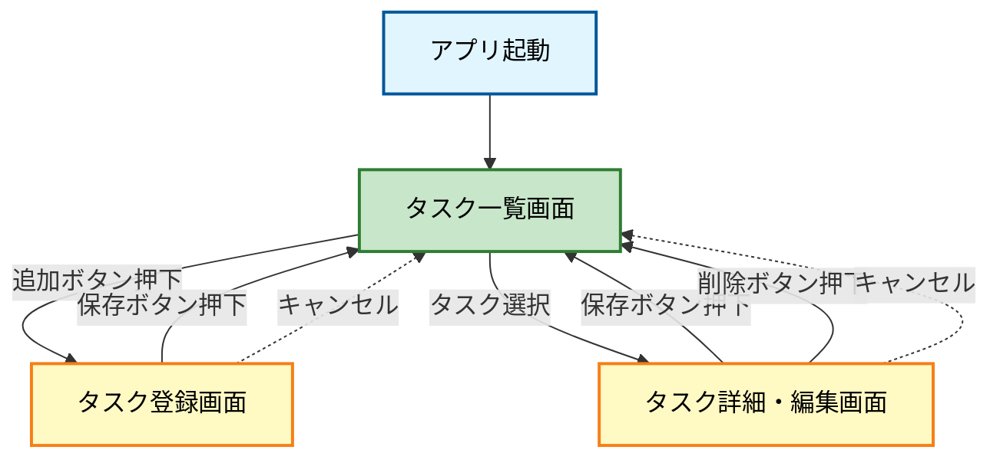

# ToDoアプリ 画面遷移図・画面項目定義

## 1. 画面遷移図



## 2. 画面項目定義

### 2.1 タスク一覧画面

**画面名**: タスク一覧画面

**目的**: 登録済みのタスクを一覧表示し、タスクの管理を行う

**画面項目**:

| 項目名 | 種類 | 説明 |
|--------|------|------|
| 画面タイトル | ラベル | 「タスク一覧」を表示 |
| タスクリスト | リスト | 登録済みタスクを表示<br>- タスク名<br>- 完了状態（チェックボックス）<br>- 期限（任意） |
| 追加ボタン | ボタン | タスク登録画面へ遷移 |
| タスク項目 | リストアイテム | タップでタスク詳細・編集画面へ遷移 |

**操作**:
- 追加ボタン押下 → タスク登録画面へ遷移
- タスク項目タップ → タスク詳細・編集画面へ遷移
- チェックボックスタップ → タスクの完了/未完了を切り替え

---

### 2.2 タスク登録画面

**画面名**: タスク登録画面

**目的**: 新規タスクを登録する

**画面項目**:

| 項目名 | 種類 | 必須 | 説明 |
|--------|------|------|------|
| 画面タイトル | ラベル | - | 「タスク登録」を表示 |
| タスク名 | テキスト入力 | ○ | タスクの名称を入力 |
| 詳細 | テキストエリア | - | タスクの詳細説明を入力（複数行） |
| 期限 | 日付選択 | - | タスクの期限を設定 |
| 優先度 | 選択リスト | - | 高/中/低から選択 |
| 保存ボタン | ボタン | - | タスクを保存してタスク一覧画面へ戻る |
| キャンセルボタン | ボタン | - | 入力内容を破棄してタスク一覧画面へ戻る |

**バリデーション**:
- タスク名: 必須入力、最大100文字
- 詳細: 最大500文字
- 期限: 過去の日付は選択不可

**操作**:
- 保存ボタン押下 → 入力内容を保存し、タスク一覧画面へ遷移
- キャンセルボタン押下 → 入力内容を破棄し、タスク一覧画面へ遷移

---

### 2.3 タスク詳細・編集画面（拡張機能）

**画面名**: タスク詳細・編集画面

**目的**: 既存タスクの詳細表示と編集を行う

**画面項目**:

| 項目名 | 種類 | 必須 | 説明 |
|--------|------|------|------|
| 画面タイトル | ラベル | - | 「タスク詳細」を表示 |
| タスク名 | テキスト入力 | ○ | タスクの名称を表示・編集 |
| 詳細 | テキストエリア | - | タスクの詳細説明を表示・編集 |
| 期限 | 日付選択 | - | タスクの期限を表示・編集 |
| 優先度 | 選択リスト | - | 高/中/低から選択 |
| 完了状態 | チェックボックス | - | タスクの完了/未完了を切り替え |
| 作成日時 | ラベル | - | タスクの作成日時を表示（編集不可） |
| 保存ボタン | ボタン | - | 変更内容を保存してタスク一覧画面へ戻る |
| 削除ボタン | ボタン | - | タスクを削除してタスク一覧画面へ戻る |
| キャンセルボタン | ボタン | - | 変更内容を破棄してタスク一覧画面へ戻る |

**バリデーション**:
- タスク登録画面と同様

**操作**:
- 保存ボタン押下 → 変更内容を保存し、タスク一覧画面へ遷移
- 削除ボタン押下 → 確認ダイアログ表示後、タスクを削除してタスク一覧画面へ遷移
- キャンセルボタン押下 → 変更内容を破棄し、タスク一覧画面へ遷移

---

## 3. 画面遷移フロー（テキスト版）

```
[アプリ起動]
    ↓
[タスク一覧画面]
    ├─→ [追加ボタン] → [タスク登録画面]
    │                      ├─→ [保存] → [タスク一覧画面]
    │                      └─→ [キャンセル] → [タスク一覧画面]
    │
    └─→ [タスク選択] → [タスク詳細・編集画面]
                           ├─→ [保存] → [タスク一覧画面]
                           ├─→ [削除] → [タスク一覧画面]
                           └─→ [キャンセル] → [タスク一覧画面]
```

## 4. 補足事項

### 4.1 データ項目
各タスクは以下のデータを持つ:
- タスクID（自動採番）
- タスク名（必須）
- 詳細説明（任意）
- 期限（任意）
- 優先度（任意、デフォルト: 中）
- 完了状態（デフォルト: 未完了）
- 作成日時（自動記録）
- 更新日時（自動記録）

### 4.2 表示順序
タスク一覧画面では、以下の順序でタスクを表示:
1. 未完了タスクを優先度順（高→中→低）
2. 同じ優先度内では期限が近い順
3. 完了タスクは最後に表示（作成日時の新しい順）

### 4.3 将来の拡張案
- カテゴリ/タグ機能
- 検索・フィルタ機能
- リマインダー通知
- タスクの並び替え（ドラッグ&ドロップ）
- サブタスク機能